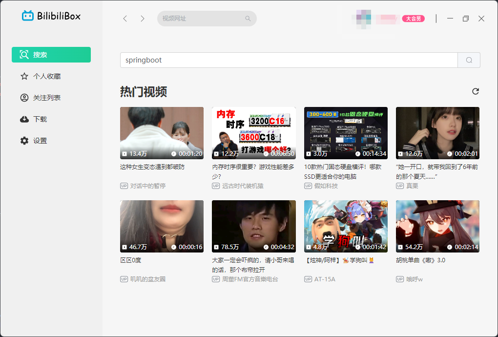
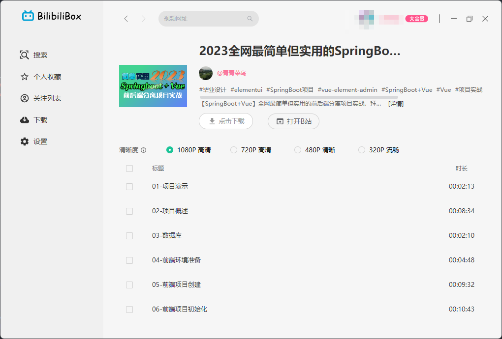
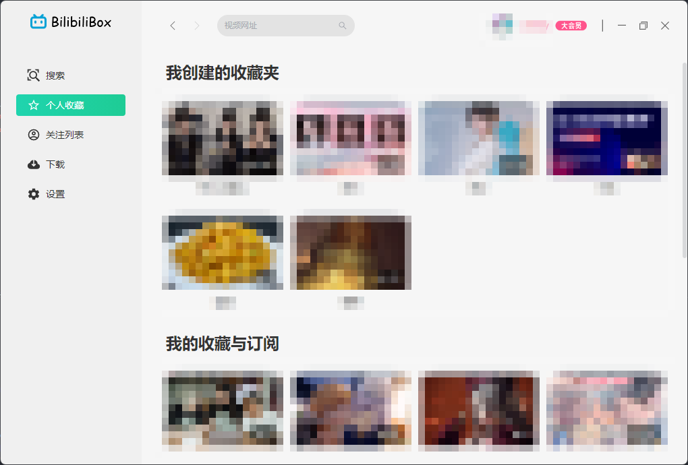
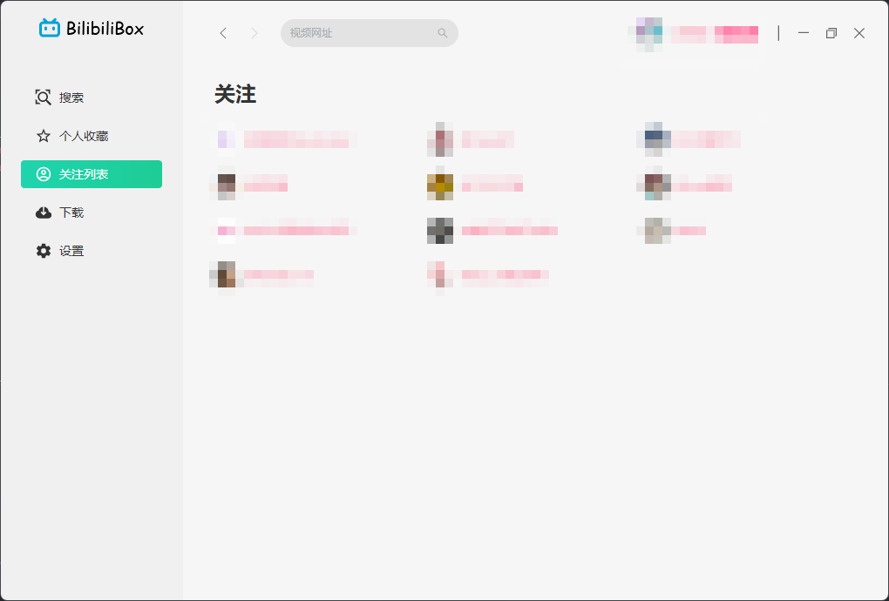
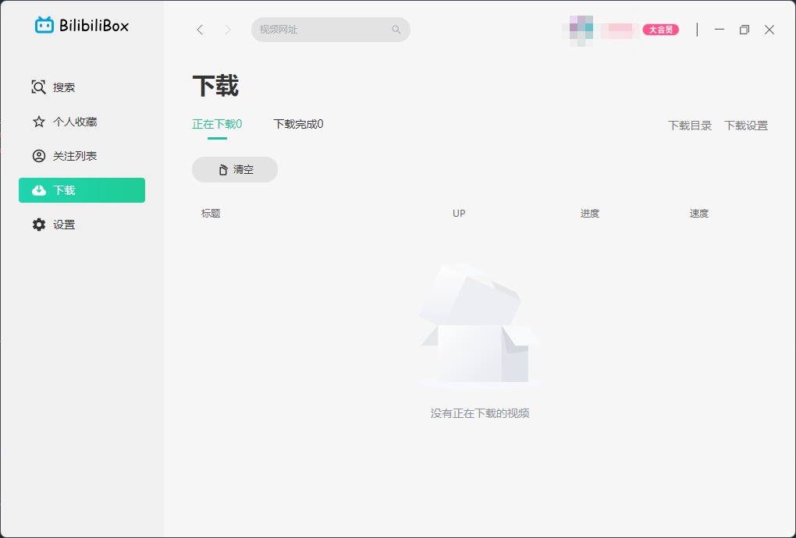
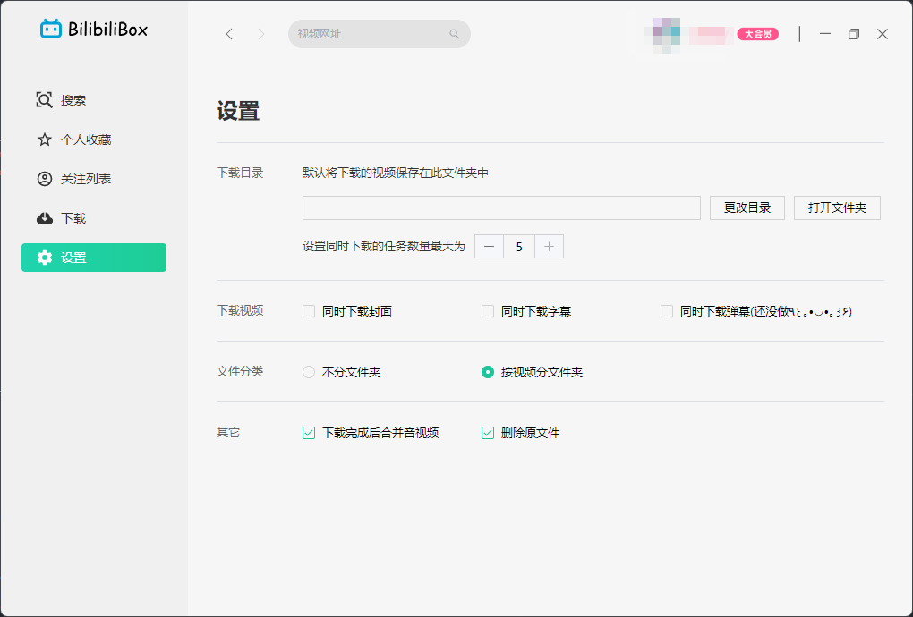

<div align="center">
  <h1>BilibiliVideoBox</h1>
  <blockquote>bilibili视频桌面端软件，UI仿照了QQ音乐桌面版</blockquote>
</div>

## 安装

克隆到本地

```
pnpm install
pnpm run electron:build
```

在项目目录下生成的dist_electron文件夹下找到安装包和win免安装程序

### 演示










## 特别鸣谢

* [BilibiliVideoDownload](https://github.com/BilibiliVideoDownload/BilibiliVideoDownload)灵感来源和代码借鉴
* [bilibili-API-collect](https://github.com/SocialSisterYi/bilibili-API-collect)B站接口支持
